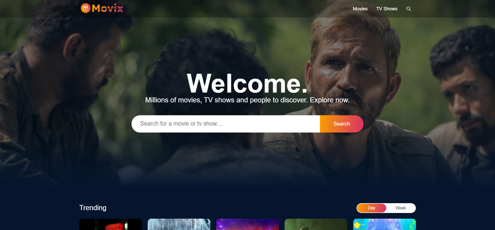

# Movix 🎬



### Movix is the movies database application available with top notch frontend technologies such as React, Redux & SCSS. 
In this application we've used core concepts of react js such as jsx, components, props, state,  lifecycle of components, conditional rendering, lists, keys & Redux, we have build more complex logics in javascript to make our react application super interactive and good looking 🚀 .


- Responsive movies database application.
- Developed with top-notch frontend technologies such as React, Redux , SCSS.
- Usage of data fetch with API from TMDB is frequently used.

# Running
1. Get Packages
```dart
- Redux Toolkit - https://www.npmjs.com/package/@reduxj...

- React Redux - https://www.npmjs.com/package/react-r...

- Axios - https://www.npmjs.com/package/axios-r...

- React Player - https://www.npmjs.com/package/react-p...

- Dayjs - https://www.npmjs.com/package/dayjs

- React Router DOM - https://www.npmjs.com/package/react-r...

- React Icons - https://www.npmjs.com/package/react-i...

- React Circular Progressbar - https://www.npmjs.com/package/react-c...

- React Infinite Scroll - https://www.npmjs.com/package/react-i...

- React Lazy Load Image - https://www.npmjs.com/package/react-l...

```

2. Get an API key from [TMDB](https://www.themoviedb.org/documentation/api) and replace it in `lib/api/api`
```dart
final apiKey = 'INSERT_YOUR_API_KEY_HERE';
```
3. Run App
```dart
npm run dev
```


### It uses the awesome [TMDB](https://www.themoviedb.org/) [API](https://www.themoviedb.org/documentation/api) to fetch the needed tv shows and movie data.


### It contains various screens like Profile Selection, Home, New & Hot, Movie and Tv Show Details Page.


## Links

[TMDB Site](https://www.themoviedb.org/)

[TMDB API](https://www.themoviedb.org/documentation/api)


## Search


